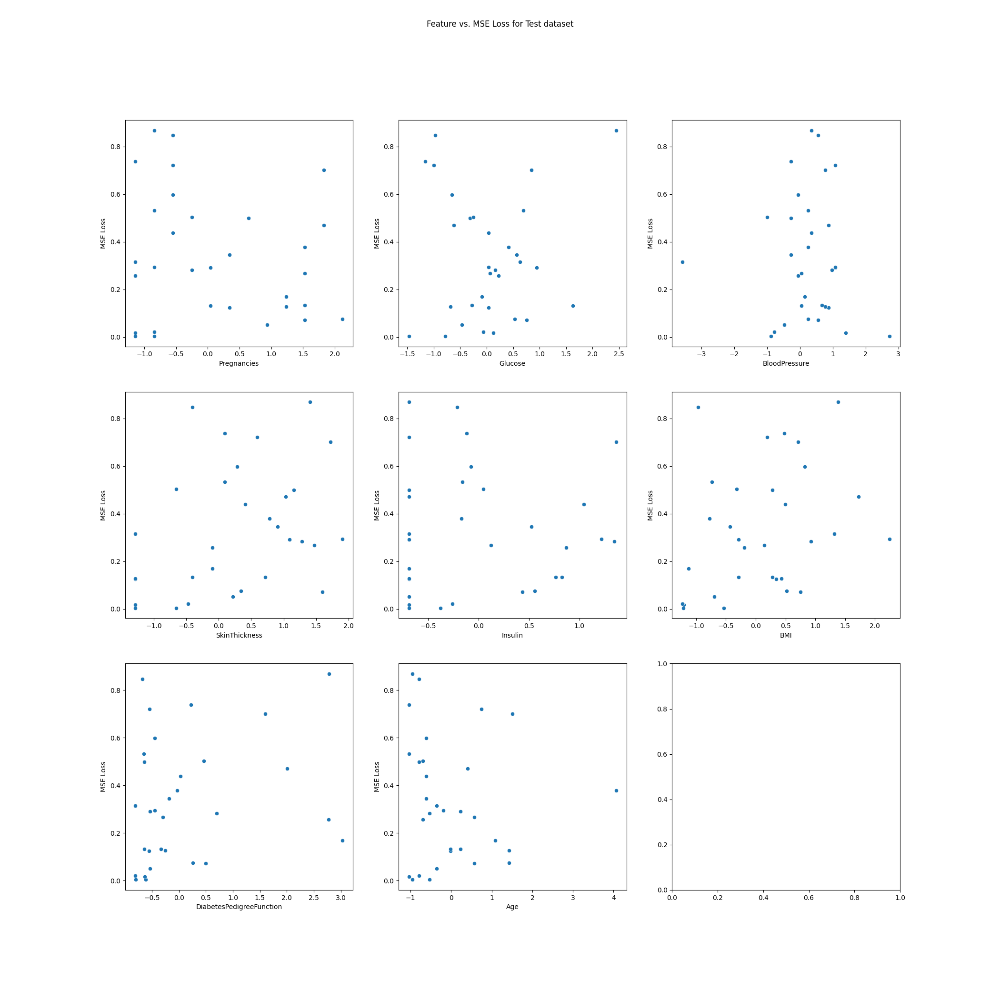

# Assignment 3 Report

## 2. Multi Layer Perceptron Classification

### 2.1 Dataset Analysis and Preprocessing

1. The description of each attribute in the Wine_QT dataset is as shown below :-
    
    

2. The distribution of the labels is skewed towards labels 5 and 6 by a large margin in the dataset. 

    

3. There are no missing values in the data. I have used sklearn's `MinmaxScaler()` to normalize and `StandardScaler()` to standardize the data. I have stored the modified dataframe as a csv file at the `data/interim/modified_Wine_QT.csv` location. 

### 2.2 Model Building from Scratch - Build an MLP classifier class

Built an MLP classifier class named `MLP_Classifier`which includes the methods for forward propagation, backpropagation, training, early stopping, fitting and predicting the data. Also includes various interchangeable activation functions along with the optimization techniques for stochastic gradient descent, gradient descent and mini-batch gradient descent. There is a `check_gradients` function which compares the analytical gradients computed through backpropagation and the numerical gradients to validate the code for back propagation. I have verified with the `check_gradients` that the wine_QT dataset passes the gradient checks after each epoch during the fitting of the training data. 

### 2.3 Model Training and Hyperparameter Tuning using W&B

Best Accuracy:  0.6447368421052632
Best Parameters:  {'Learning Rate': 0.05, 'Optimizer': 'mini-batch', 'Hidden Layers': 2, 'Neurons': [8, 10], 'Activation Function': 'relu', 'Epochs': 50}

1. The trend of loss and accuracy on training and validation set with change in the hyperparameters using W&B can be seen at [2.3 W&B](https://wandb.ai/kushang-international-institute-of-information-technolog/2.3%20Model%20Training%20%26%20Hyperparameter%20Tuning%20using%20W%26B?nw=nwuserkushang).

    

    

    

    

2. The table is too large to be visualized as an image involving 144 combinations. I have stored the table by exporting it from W&B as a csv file. It is stored as `assignments/3/hyptun_wine_mlp_classification_results.csv`. 

3. The best model observed has an accuracy of `64.03%` on the validation set of `wine_QT.csv` dataset. This model has been saved as `models/mlp/2_3_mlp_classification_wineQT_best_model.joblib` The parameters for this best model are:-

    - Learning rate - 0.01
    - Optimizer - SGD
    - Number of hidden layers - 2
    - Number of neurons - [16,8]
    - Activation function - tanh 
    - Number of epochs - 100

### 2.4 Evaluating Single-Label Classification Model

Evaluating the best model on the test set gives the following metrics:-

- Accuracy: 62.60869565217392 
- Precision: 29.787878787878785
- Recall: 28.975468975468976
- F1 Score: 28.973572246768126
- Loss: 0.9416937566574594

### 2.5 Analyzing Hyperparameters Effects

1. Effect of non-linearity - Varied activation functions between [`tanh`,`sigmoid`,`ReLU`,`linear`].

    - Observations:

        1. Sigmoid starts with the highest initial loss and rapidly decreases during initial epochs but converges very slowly compared to other functions indicating slower learning.

        2. ReLU starts with a lower initial loss compared to sigmoid and tanh but also has oscillations during training. However, shows a steady improvement in validation loss thereby converging faster compared to the other functions with early stopping.

        3. tanh has a similar starting validation loss as ReLU but experiences fewer oscillations during the training process. It also converges slightly slower than ReLU, but stabilizes around the same validation loss.

        4. Linear activation functions gives `Nan` loss values with the learning rate value set to 0.01 so we dont see any graph of linear activation function. 
    
    

2. Effect of learning rate - Varied learning rates between [0.001,0.01,0.05,0.1]. 

    - Observations:

        1. `lr=0.001` starts with the highest initial validation loss and there is a gradual decrease in the validation loss after the initial few epochs taking longer to converge compared to higher learning rates. While this may be slower, it ensures that our gradients do not overshoot. 

        2. `lr=0.01` starts with a much lower initial validation loss and experiences faster convergence. There are minor oscillations throughout the process, but overall, the model converges at a reasonable pace and does not overshoot. A learning rate of 0.01 seems to offer a good balance between speed and stability.

        3. `lr=0.05` begins with a slightly higher initial validation loss than lr=0.01 but rapidly decreases within the first few epochs. It converges the quickest. This suggests that 0.05 is highly efficient for fast convergence with stable performance after an initial sharp drop.

        4. `lr=0.1` shows significant oscillations with sharp ups and downs without stabilizing quickly suggesting that this causes the gradients to overshoot leading to instabiliy and difficulties in convergence.

    

3. Effect of Batch Size - Varied batch sizes between [16,32,64,128]. 

    - Observation : The graph shows that smaller batch sizes (16 and 32) lead to faster convergence, with `batch size=16` achieving the lowest validation loss the quickest. As the batch size increases, the convergence becomes slower, with batch size 128 starting with a higher validation loss and taking significantly more epochs to approach the same performance. Smaller batch sizes seem to allow the model to adapt more effectively per epoch, while larger batch sizes result in slower convergence, possibly due to less frequent weight updates during training.

    

### 2.6 Multi-Label Classification

Working with the dataset `advertisement.csv`. Preprocessed the dataset by converting the labels to binary vectors and features to one hot encoded vectors wherever required and then standardized the data. Stored the modified dataset in `data/interim/advertisement_modified.csv`.

1. Created a seperate MLP class for handling multi-label classification named `MLP_Multi_Classifier()` in the `models/mlp/` folder. 

2. Used W&B for hyperparameter tuning. 

    1. The trend of loss and accuracy on training and validation set with change in the hyperparameters using W&B can be seen at [2.6 W&B](https://wandb.ai/kushang-international-institute-of-information-technolog/2.6%20Model%20Training%20%26%20Hyperparameter%20Tuning%20using%20W%26B?nw=nwuserkushang).

        

        

        

        

        

        
    
    2. The table is too large to be visualized as an image involving 144 combinations. I have stored the table by exporting it from W&B as a csv file. It is stored as `assignments/3/hyptun_advertisement_multi_classification_results.csv`.

    3. The best model observed has an accuracy of `66.4375%` on the validation set of `advertisement.csv` dataset. This model has been saved as `models/mlp/2_6_mlp_classification_advertisement_best_model.joblib` The parameters for this best model are:-

        - Learning rate = 0.05
        - Activation funcion = ReLU
        - Optimizer = mini-batch
        - Number of hidden layers = 2
        - Number of neurons =[16,8]
        - Number of epochs = 50

3. Evaluating the best model on the test set gives the following metrics:-

    - Hamming Accuracy: 62.875 %
    - Loss: 0.37125
    - Cross Entropy Loss: 5.30161
    - Precision: 0.25
    - Recall: 0.01384
    - F1 Score: 0.0279

### 2.7 Analysis

The model seems to do really well at classifying 'electronics', 'beauty', 'furniture', 'books' with electronics and furniture being the predominant ones. 

Possible Reasons for Poor Performance:

- **Class Imbalance** : The dataset might have an uneven distribution of classes, making it difficult for the model to learn less common categories.

- **Multi-Label Classification** : Many instances have multiple labels (e.g., 'beauty, books, electronics, furniture, home'). This is a more complex problem than single-label classification and may require specialized techniques.

- **Feature Representation** : The model might not have adequate features to distinguish between different product categories effectively. 

- **Class Overlap** : Some categories might share similar attributes, causing the model to confuse them.

## 3. Multilayer Perceptron Regression

### 3.1 Data Preprocessing

1. Description the dataset using mean, standard deviation, min, and max values for all attributes.

    

2. I've plotted a histogram showing the distribution of various attributes in the dataset using Matplotlib.

    

3. 

4. Filled the missing values with the median of that attribute and standardized the data across all attributes. 

    

### 3.2 MLP Regression Implementation from Scratch 

Created a class called `MLP_Regression` in the `models/mlp/mlp_regression.py` file. It includes all the required methods asked to be implemented.

### 3.3 Model Training & Hyperparameter Tuning using W&B

1. The trend of loss values (MSE) with change in the hyperparameters using W&B can be seen at [3.3 W&B](https://wandb.ai/kushang-international-institute-of-information-technolog/SMAI%20A3%203.3%20Model%20Training%20%26%20Hyperparameter%20Tuning%20using%20W%26B?nw=nwuserkushang).

    

    

2. The table is too large to be visualized as an image involving many combinations. I have stored the table by exporting it from W&B as a csv file. It is stored as `assignments/3/hyptun_housing_mlp_regression_results.csv`. 

3. The best model observed has a loss of `0.11` on the validation set of `HousingData.csv` dataset. This model has been saved as `models/mlp/3_3_mlp_regression_housing_best_model.joblib`. The parameters and metrics for this best model are:-

    - Learning rate = 0.05 
    - Activation funcion = sigmoid
    - Optimizer = SGD
    - Number of hidden layers = 2
    - Number of neurons = [16,8]
    - Number of epochs = 100
    - Training MSE = 0.122717
    - Training RMSE = 0.35031
    - Training R2 = 0.881945
    - Validation MSE = 0.111101
    - Validation RMSE = 0.333319
    - Validation R2 = 0.873657

### 3.4 Evaluating Model

Evaluating the best model on the test set gives the following metrics:-

- Mean Squared Error:  0.4225828722619414
- Root Mean Squared Error:  0.6500637447681122
- R Squared:  0.49269980959975324
- Mean Absolute Error:  0.39970874403298784

### 3.5 Mean Squared vs Error vs Binary Cross Entropy

1. Used the MLP class to make two models which uses bce_loss and mse_loss in its backward pass and trained them on the dataset. The models are stored as `models/mlp/3_5_logistic_mse.joblib` and `models/mlp/3_5_logistic_bce.joblib`. 

2. The plots for loss vs epochs for both the loss functions are shown below. 

    

    

3. 
    - Using SGD : The range of the validation loss values differs for the two loss functions. BCE's loss starts from a higher value (~0.75) and reduces to around 0.5, while MSE loss starts from a lower value (~0.25) and converges around 0.16. This is expected because the two loss functions measure different aspects: BCE focuses on probability-based calculatiion, while MSE measures squared errors, which explains the lower values in the latter. MSE starts to converges to around 0.16 in about 8-10 epochs while BCE takes longer to converge, around 15-20 epochs. However, both models have a similar accuracy of around 74% on the validation set.

        

        

    - Using Mini-Batch : We see that the loss for MSE dosent converge yet early stops but BCE does well here as well. BCE directly measures the error in predicted probabilities compared to the true labels, thereby more suited for this classification task compared to MSE usually used for regression tasks. It also seems to converge in a much more stable manner compared to MSE thereby could be performing better for logistic regression task. Here, there is a vast difference in the accuracy with MSE giving around 52% and BCE giving the same as before, 72% thereby showing the supremacy of BCE.

        

        

    - All the above models are stored in `models/mlp/` folder.

### 3.6 Analysis 

#### Diabetes Dataset 

- The outputs observed for the test dataset are :-

    

- I plotted the MSE loss of the test data points against each normalized feature of the test dataset.

    

    1. The model seems to perform better on typical cases but struggles with extreme or unusual combination of attributes. 

    2. `Squared Error Penalty` - MSE penalizes large errors more heavily compared to smaller ones. This explains why we see very high MSE for misclassified cases. 

    3. `Sigmoid Non-linearity` - The model struggles to capture the non-linear relationships in nature possibly due to the fact that it is performing logistic regression which introduces non-linearity only in the output space and not in the feature space. Using MSE implicitly assumes a more linear relaionship explaining better performance in the mid-ranges of feature values. 

    4. `Limited Feature Interaction` - We can see higher MSE loss for medium to higher values of High glucose, BMI and diabetes pedigree function showing that the model fails to capture interactions between features. This is due to no hidden layers between the inputs and outputs disallowing the model to capture useful interactions. 

    5. `Regression-like behaviour` - Using MSE loss with logistic regression essentially turns it into a form of regression for probability estimation, rather than pure classification. 

#### Housing Dataset

- **High MSE Data Points**: These points show large prediction errors across features like RM (rooms), AGE (old housing units), and LSTAT (lower-status population), suggesting the model struggles with data that diverges from the training distribution.

- **Low MSE Data Points**: Low-error points tend to have feature values closer to the dataset's average, where the model makes more accurate predictions due to familiarity with the feature patterns from training.

- **Impact of Outliers**: High MSE often corresponds to outliers or underrepresented feature values, while more typical data points yield lower MSE, showing that the model struggles to generalize beyond familiar patterns.

- **Possible Causes of High MSE**: Non-linear relationships, variability in key features like RM, LSTAT, and AGE, and potential overfitting or underfitting contribute to higher errors.

- **Additional Insights**: Features like ZN and CHAS add noise, increasing MSE, while RAD (highway accessibility) significantly impacts error rates. The model needs better generalization to handle atypical data effectively.

## 4. AutoEncoders

### 4.1 AutoEncoder implementation from scratch

The optimal dimension that our dataset was reduced to using PCA in assignment-2 was 12. So, we choose latent_dimension=12. All three methods `__init__()`, `fit()` and `get_latent()` have been implemented using the `MLP_Regression` class.

### 4.2 Train the autoencoder

The encoder has been trained on the spotify dataset from assignment 1. The model early stops at epoch 125 with the final validation loss of 0.06566. I have saved this model in `models/autoencoder/4_2_autoencoder.joblib`.

- Hyperparameters 

    1. Learning rate - 0.001
    2. Optimizer - Mini-Batch
    3. Number of hidden layers - 3
    4. Number of neurons - [14,12,14] (12 is the latent dimension)
    5. Activation function - tanh

### 4.3 Autoencoder + KNN 

1. Used the trained model on the dataset to obtain the output of the encoder which is the reduced dataset. Applied the KNN model from assignment 1 on the reduced dataset and the following metrics were observed -

    - Accuracy: 24.170202871592164
    - Macro Precision: 20.88232241675781
    - Macro Recall: 21.42831683589271
    - Macro F1: 20.64835116689726
    - Micro Precision: 24.170202871592164
    - Micro Recall: 24.170202871592164
    - Micro F1: 24.170202871592164

2. Comparison with assignment-1 and assignment-2 results. 

    1. Improvement over standard KNN: The AutoEncoder + KNN approach showed improved metrics compared to the standard KNN model used in Assignment 1. This improvement can be attributed to the following factors:

        - `Dimensionality reduction`: The autoencoder reduces the dimensionality of the data, which can help in removing noise and capturing the most important features of the dataset.

        - `Non-linear transformations`: Autoencoders can capture non-linear relationships in the data, potentially leading to a more informative reduced representation.

        - `Feature learning`: The autoencoder learns a new representation of the data that might be more suitable for the classification task.
    
    2. Similar performance to PCA + KNN: The metrics obtained from the AutoEncoder + KNN approach are reported to be the same as those from the PCA + KNN approach in Assignment 2. 

        - `Optimal dimensionality`: Since you mentioned that the autoencoder reduces the data to the same optimal dimensions as PCA, both methods are working with a similar amount of information.

        - `Dataset characteristics`: The nature of your specific dataset might be such that both linear (PCA) and non-linear (autoencoder) dimensionality reduction techniques yield similar results.

        - `Overfitting`: The autoencoder might be overfitting to the training data, failing to generalize better than PCA.

### 4.4 MLP Classification 

Using the `MLP_Classification()` class, trained the dataset on the spotify dataset which has 113 classes.

- The hyperparameters used were:-

    1. Learning Rate - 0.001
    2. Optimizer - SGD
    3. Activation Function - tanh
    4. Number of hidden layers - 2
    5. Number of neurons - [64,256]
    6. Number of epochs - 500 (Early stopping at 34)

- The validation metrics observed after training were:-

    1. Accuracy - 37.94 %
    2. Macro Precision - 33.62232917407127 %
    3. Micro Precision - 37.755042725106086 %
    4. Macro Recall - 33.414798504776827 %
    5. Micro Recall - 37.755042725106086 %
    6. Macro F1 - 32.193557022096997 %
    7. Micro F1 - 37.755042725106086 %